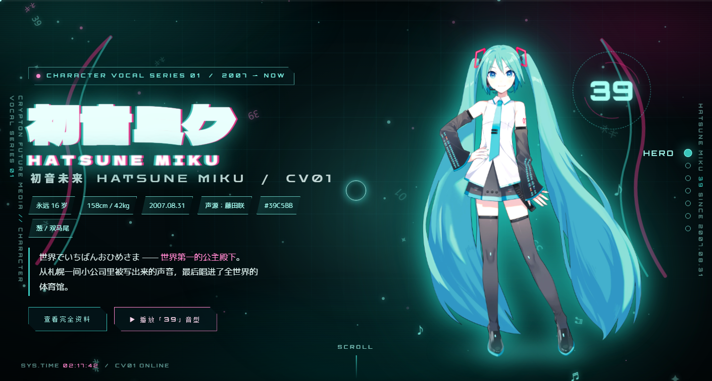
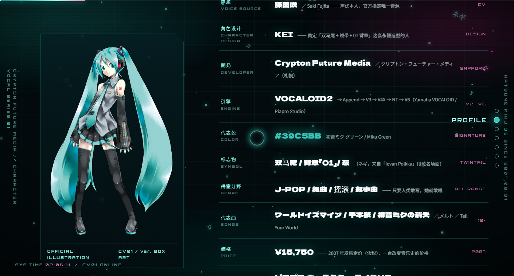
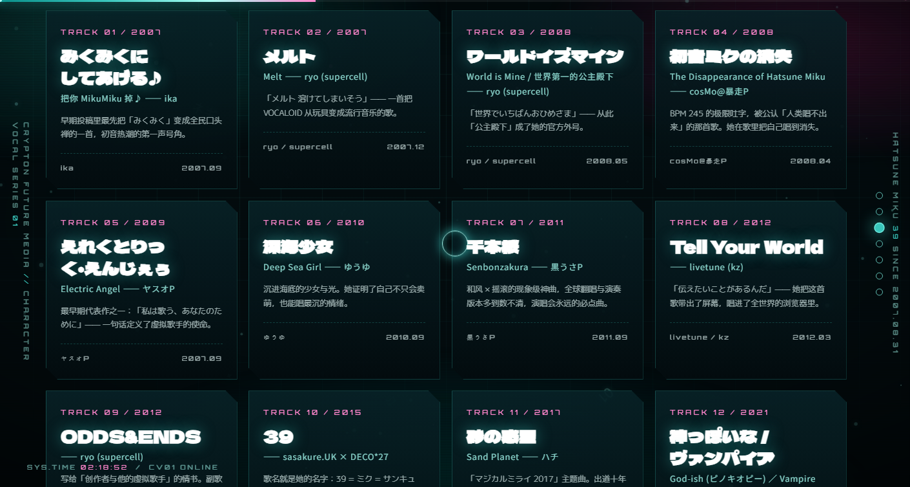
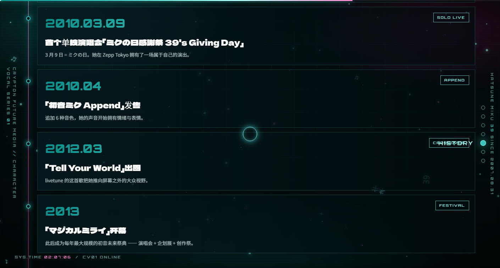
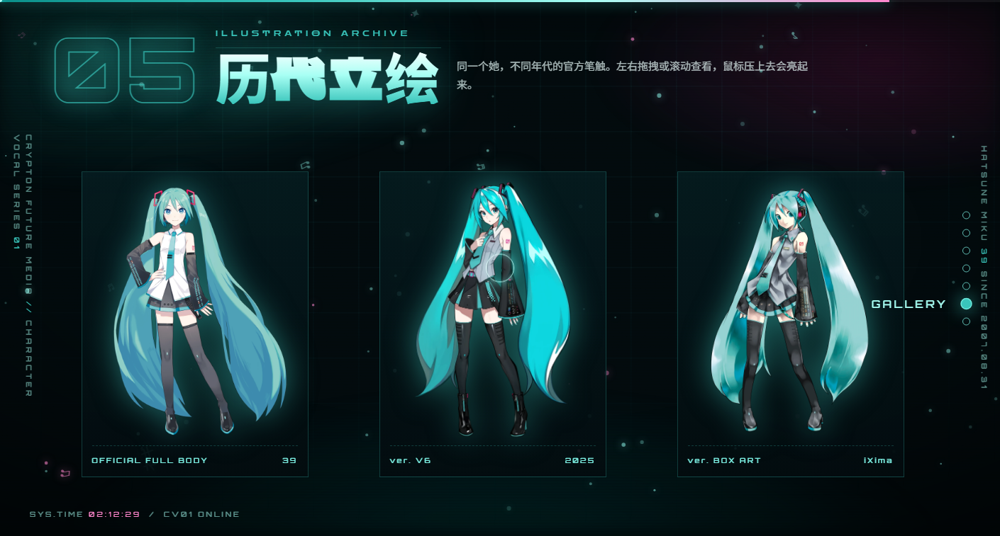
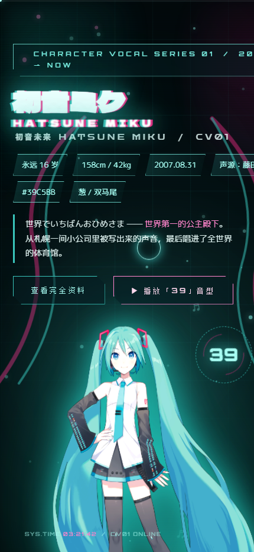

# 初音ミク / HATSUNE MIKU — CV01 介绍页

> **English**: A zero-build fan page for Hatsune Miku (CV01) — profile, twelve signature songs, backstory, milestones and six official illustrations, all in one static HTML file.

<p align="center">
  
  
  
  
</p>
<p align="center">
  
  
  
  
</p>

<p align="center">
  <b>▶ 线上地址：<a href="https://liceses.github.io/hatsune-miku-cv01/">https://liceses.github.io/hatsune-miku-cv01/</a></b>
</p>

她不是某部动画的女主角：没有剧情、没有结局，设定只有一个起点 —— 剩下的，全人类一起写。
这一页把散在几十个页面里的资料（铭牌 / 代表曲 / 设定背景 / 演唱会里程碑 / 历代立绘）
压成**一个文件**，让第一次点进来的人在 30 秒内认识她，也让想改的人只需要打开一个 HTML。

**零框架、零构建、零 CDN、零外部请求** —— 拔掉网线双击 `index.html`，她照样开唱。


*图 · 首屏实拍：巨型「初音ミク」标题 + 6 枚属性 chip + 全身立绘 + 自转 `39` 徽章，外层是 HUD（顶部进度条 / 两侧竖排 rail / 右侧 7 个导航点 / 系统实时时钟）。*

---

<a id="quickstart"></a>
## 🥬 快速开始

**前置条件：没有。** 不需要 Node、不需要 `npm install`、不需要构建步骤、不需要填任何 Key。

```bash
# 方式 A · 任何有 Python 的机器（本次实跑过：首页与 fonts.css 都返回 200）
python -m http.server 8899      # 在仓库根目录执行 → 打开 http://127.0.0.1:8899/

# 方式 B · Windows 一键（双击，不用敲命令）
#   打开页面.cmd —— 自己去找 node → 起 tools/serve.mjs → 开浏览器；找不到 node 就退化成直接开 index.html
```

**你会看到**：先是开机动画（`0% → 100%` 进度条 + 伪终端文案），结束后右下角 toast 一句
「CV01 上线 —— 39 / 初音ミク」，然后落进首屏。往下滚，七个 section 一路推到底，中间夹两条无缝跑马灯。

> `打开页面.cmd` 和 `node tools/serve.mjs` 里有一个**写死的绝对路径**问题，换机器会 404 ——
> 见 [已知限制与坑](#limits) 第 2 条。不想读那一节就用方式 A。

---

<a id="toc"></a>
## 📖 目录

| 想了解 | 看这里 |
| --- | --- |
| 一屏看完所有硬事实 | [一眼看懂](#facts) |
| 页面上到底有什么 | [页面里有什么](#sections) |
| 它是怎么动起来的 | [她是怎么动起来的](#how) |
| 每个交互怎么实现的 | [交互清单](#interactions) |
| 长什么样 | [页面实拍](#shots) |
| 文件都放在哪 | [目录结构](#tree) |
| 怎么部署 / 自建一份 | [部署 / 自建一份](#deploy) |
| 有什么坑 | [已知限制与坑](#limits) |
| 立绘和字体能商用吗 | [素材与版权](#credits) |
| 代码什么许可 | [许可与致谢](#license) |

---

<a id="facts"></a>
## ✨ 一眼看懂

| 项 | 事实 |
| --- | --- |
| 页面本体 | `index.html` · **479 行 / 29.2 KB** —— 结构、文案、SEO meta 全在这一个文件里 |
| 样式 | `assets/css/miku.css` · **1261 行 / 35.7 KB** —— 手写 CSS，23 个自定义属性、**21 个 `@keyframes`**、4 个 `@media` 块 |
| 交互 | `assets/js/miku.js` · **429 行 / 16.3 KB** —— 原生 ES2020，单个 IIFE，**0 个 `import` / `require`** |
| 字体 | `assets/fonts/` · **479 个 woff2** 子集 + `fonts.css`（**582 条 `@font-face`**），5 个字族，全部本地文件 |
| 立绘 | `assets/img/png/` · **7 张**官方透明 PNG（6 张立绘 + 1 张字标），单张最大 1.13 MB |
| 截图 | `preview/` · **6 张**页面实拍（约 347 KB ~ 814 KB，含 1 张 430px 窄屏） |
| 外部请求 | **0**。没有 CDN、没有 Google Fonts 外链、没有统计脚本、没有 iframe；`index.html` 里唯一的 `https` 出现在页脚 4 条「资料来源」`<a href>` 上，点了才请求 |
| 仓库体积 | 约 **17.1 MB**，几乎全是字体与立绘 |
| 构建步骤 | **无**。没有 `package.json`，没有 `node_modules`，改完刷新浏览器就是最新版 |
| 响应式 | `1080px` / `640px` 两档断点；触屏设备自动关掉自定义光标与导航点 |
| 无障碍 | 跟随系统 `prefers-reduced-motion`，动画时长压到 0.001s，tilt / 视差 / 残影全部停摆 |
| 主色 | 初音ミク グリーン `#39C5BB`，点缀粉 `#FF2F8E` |

> 体积一律按 **1 KB = 1024 B** 计。

---

<a id="sections"></a>
## 🎤 页面里有什么

七个 section 一路推到底，中间夹两条无缝跑马灯：

| # | 区块 | 内容 |
| --- | --- | --- |
| — | **BOOT** | 开机动画：`0% → 100%` 进度条 + 伪终端文案，结束后 toast「CV01 上线 —— 39 / 初音ミク」 |
| — | **HUD** | 顶部滚动进度条、左右两列竖排 rail、右侧 7 个导航点（悬停显示区块名）、系统实时时钟 |
| — | **HERO** | 巨型「初音ミク」标题 + 英文副题、6 枚属性 chip、引言、2 个 CTA、全身立绘、自转 `39` 徽章、5 个飘浮音符、两条双马尾绸带 SVG |
| 01 | **PROFILE** | **16 行铭牌**：名前 / 身長 158cm / 体重 42kg / 年齢 16 / 誕生日 2007.08.31 / 声源 藤田咲 / 角色设计 KEI / 開発 Crypton（札幌）/ 引擎 V2→V6 / 代表色 #39C5BB / 标志物 / 得意分野 / 代表曲 / 価格 ¥15,750 / 授権 PCL / 設定背景；配 V3 盒绘卡 + **6 个滚动计数卡** |
| — | **TICKER ×2** | 曲名 / 关键词无缝跑马灯，反向滚动一条 |
| 02 | **SONGS** | **12 张**代表曲卡：曲名、中文释义、P 主、年月、一句话点评、悬停弹出 6 条均衡器 |
| 03 | **STORY** | **6 张**设定卡（名字由来 / 2007 诞生 / PCL 授权 / 演唱会与现实世界 / 永远的 16 岁 / 她属于谁）+ 一段大字引言 |
| 04 | **HISTORY** | **13 个**里程碑：2007.08.31 发售 → 2007 创作雪崩 → 神曲期 → 2009 首次登台 → 2010.03.09 39's Giving Day → Append → 2012 Tell Your World → 2013 マジカルミライ → 2014 MIKU EXPO → V4X → NT → 2025.12 V6 → 2026 北美巡演 10 万人 |
| 05 | **GALLERY** | **6 张**历代立绘横滑画廊，可鼠标抓拽 |
| — | **OUTRO** | 巨型「39」+「サンキュー、そしてこれからも。」+ 三个按钮（葱雨 / 再唱一段 / 回到顶端） |
| — | **FOOTER** | 版权声明、素材说明、4 条资料来源外链、`CV01 / 158CM / 42KG / 2007.08.31 / #39C5BB / 39` |

---

<a id="how"></a>
## 🔧 她是怎么动起来的

一句话原理：**没有动画库，也没有请求外部资源 —— 页面把「动」拆成三条互相不干扰的线，各自用浏览器最原生的能力实现。**

| 线 | 做法 | 关键点 |
| --- | --- | --- |
| 背景 | 5 个纯 CSS 层（极光 `bg-aurora` / 网格 `bg-grid` / 扫描线 `bg-scan` / 噪点 `bg-noise` / 暗角 `bg-vignette`）叠在 1 个全屏 `<canvas>` 上 | 层次感靠叠加与混合，不靠图片 |
| 循环 | 常驻 3 条 `requestAnimationFrame`：自定义光标缓动（0.16）、canvas 粒子场、HERO 立绘视差（0.07） | 粒子场在 `visibilitychange` 隐藏时**停掉**，不在后台空转；`.tilt` 是每个元素按需启停的第 4 条（0.18） |
| 滚动 | 3 个 `IntersectionObserver` 各管一件事：区块揭示（阈值 0.12）、数字滚动计数（0.4）、英文小标题乱码解码（0.6） | 一次性 `unobserve`，滚过去就不再观察 |
| 声音 | WebAudio **现场合成**：10 音方波主旋律 + 3 段三角波贝斯 + 26 颗正弦星点，经低通滤波 2600 → 900 Hz | **不加载任何音频文件** |
| 跑马灯 | JS 只把轨道内容复制一份（`data-clone`），位移交给 CSS `tickerRun` 关键帧 | 无缝循环不需要 JS 逐帧算 |

所以整个「引擎」就是：**1 个 IIFE + 1 个 canvas + 3 个观察者 + 3 条 rAF**，没有一行依赖。

---

<a id="interactions"></a>
## 🖱️ 交互清单（全部手写，无库）

| 触发 | 表现 | 实现要点 |
| --- | --- | --- |
| 鼠标移动 | 自定义葱绿光标：实心点 + 缓动环（悬停可交互元素变粉加粗），身后撒 🥬 ♪ ♫ ✿ 残影 | `mousemove` + rAF 缓动系数 0.16；残影 46ms 节流、950ms 自动移除 |
| 全程 | 全屏 canvas 粒子场：音符 / `39` / `01` / `ネギ` / `✦` 字形与发光圆点，桌面 108 个、窄屏 46 个，随鼠标做视差偏移 | `#miku-canvas`，DPR 上限 2，`visibilitychange` 时暂停 rAF |
| 悬停卡片 / 立绘 | 3D tilt：`perspective(900px)`，横向 ±16°、纵向 ∓14°，离开弹性回位 | rAF 缓动 0.18，仅 `pointer:fine` 且未开启 reduced-motion 时启用 |
| 悬停 HERO 立绘 | 视差跟手 + 微缩放 + CSS 呼吸浮动 + 马尾甩动 + 39 徽章自转 | rAF 缓动 0.07 + `heroFloat` / `tailWhip` / `badgeSpin` 关键帧 |
| 滚动 | 顶部进度条、右侧导航点高亮、分区揭示（模糊 → 清晰）、英文小标题乱码解码、数字滚动计数 | 3 个 IntersectionObserver + `scroll` 监听，揭示延迟按 `i % 4` 错峰 70ms |
| 悬停代表曲卡 | 底部 6 条均衡器逐条跳动 | `eqBeat` 关键帧 + 每条 `i` 错峰延迟 |
| 点击 **🥬 让葱下起来** | 56 个 🥬 / ♪ / ♫ / ネギ / 39 从天而降，随机大小、时长、延迟、葱绿或粉色光晕 | 动态插 `<span>`，`leekFall` 关键帧，7.4s 后自动回收 |
| 点击 **▶ 播放「39」音型** | WebAudio **现场合成**：方波主旋律（10 音）+ 三角波贝斯 + 26 颗正弦星点，经低通滤波扫频 2600Hz → 900Hz 后衰减 | `OscillatorNode` + `GainNode` + `BiquadFilterNode`，**不加载任何音频文件** |
| 按 `M` / `3` | 彩蛋：葱雨 40 个 / 9 个 + toast | `keydown` |
| 拖拽历代立绘 | 横向抓拽滚动（含抓取光标） | `pointerdown/move/up` 手动同步 `scrollLeft` |
| 停留 4.2 秒 | toast 提示「按 M 键 —— 有惊喜 🥬」 | `setTimeout` |
| 触屏设备 | 隐藏自定义光标、`640px` 以下隐藏导航点、粒子数降到 46 | `@media (pointer: coarse)` + JS 分支 |
| 系统「减少动态效果」 | 关掉 tilt、视差、鼠标残影，动画与过渡时长压到最短 | `prefers-reduced-motion` + JS `matchMedia` 判断 |

---

<a id="shots"></a>
## 📸 页面实拍

首屏见本文顶部 `preview/hero.png`。剩下几屏：

|  |  |
| :--: | :--: |
| **01 PROFILE** — 16 行铭牌 + 6 个计数卡 | **02 SONGS** — 12 张代表曲卡，悬停弹均衡器 |
|  |  |
| **04 HISTORY** — 13 个里程碑：2007 → 2026 | **05 GALLERY** — 6 张历代立绘，可抓拽横滑 |

窄屏（`430px`，对应 `@media (max-width: 640px)` 那一档）：

|  |
| :--: |
| **430px 窄屏实拍** — 右侧导航点隐藏、铭牌收成两列、粒子降到 46、立绘压到首屏下半 |

> `preview/` 里的 6 张都是**真实页面截图**，不是示意图：`mobile.png` 是本次新增
> （Edge 无头 + 本地 `python -m http.server`），其余 5 张是仓库原有的整窗口实拍。

---

<a id="tree"></a>
## 🗂️ 目录结构

```
hatsune-miku-cv01/                    ← 仓库根目录 = 站点根目录
├─ index.html                         页面本体：BOOT + HUD + 7 个 section + 页脚（479 行）
├─ README.md                          本文件
├─ LICENSE                            MIT（代码部分）+ Crypton 版权归属说明
├─ robots.txt                         允许全部抓取 + Sitemap 指向
├─ sitemap.xml                        只列线上首页这一条 URL
├─ .gitignore                         系统垃圾 / 编辑器 / 日志（含 tools 会写的 _log.txt）
├─ .nojekyll                          让 GitHub Pages 原样直出，跳过 Jekyll 处理
├─ 打开页面.cmd                       Windows 一键预览：找 node → 起服务 → 开浏览器（8899）
├─ assets/
│  ├─ favicon.svg                     纯 SVG 图标：葱绿双马尾 + 一根葱 + 数字 39（64×64，无外链）
│  ├─ css/
│  │  └─ miku.css                     设计变量 / 版式 / 21 个关键帧 / 两档响应式（1261 行）
│  ├─ js/
│  │  └─ miku.js                      粒子场 / tilt / 计数 / 葱雨 / WebAudio（429 行）
│  ├─ fonts/
│  │  ├─ fonts.css                    582 条 @font-face，按 unicode-range 切成子集
│  │  ├─ delagothic/    （123 个 woff2）Dela Gothic One —— 巨型标题
│  │  ├─ notosanssc/    （101 个 woff2）Noto Sans SC 400/900 —— 中文正文
│  │  ├─ mplusrounded/  （252 个 woff2）M PLUS Rounded 1c —— 日文小字
│  │  ├─ orbitron/      （  1 个 woff2）Orbitron —— 数字 / 仪表
│  │  └─ zendots/       （  2 个 woff2）Zen Dots —— 英文标签
│  └─ img/
│     └─ png/                         7 张官方透明 PNG：
│                                     hero_miku / miku_v3 / miku_v3box / miku_v6 /
│                                     miku_chinese / miku_pocket / logo_word
├─ preview/                           6 张页面实拍：hero / profile / songs / history / gallery / mobile
└─ tools/
   ├─ serve.mjs                       静态服务器：127.0.0.1:8899，禁目录穿越，no-store
   ├─ dl-img.mjs                      立绘抓取脚本（vocaloid.fandom.com，7 条源 URL）
   └─ dl-fonts.mjs                    字体抓取脚本（Google Fonts woff2，5 个字族）
```

---

<a id="deploy"></a>
## 🚀 部署 / 自建一份

仓库根目录就是站点根目录，`index.html` 在最外层 —— **任何静态托管都能直接吃下去，不需要构建命令、不需要环境变量**。

- **GitHub Pages**：Settings → Pages → Source 选 `Deploy from a branch` → 分支 `main`、目录 `/ (root)` → 保存。线上地址即 `https://<用户名>.github.io/<仓库名>/`。仓库里已放 `.nojekyll`，Pages 会原样直出、不做 Jekyll 预处理。
- **其他平台**：Nginx / Cloudflare Pages / Vercel / Netlify / 对象存储，把整个目录当静态资源目录丢上去即可；构建命令留空，输出目录填 `.`。
- **换域名或换仓库名之后**：记得同步改 `robots.txt` 与 `sitemap.xml` 里的绝对 URL。
- **想只发布不公开源码**：全部资源都是同源相对路径，打包 `index.html + assets/` 就够跑（`preview/`、`tools/`、`README.md` 可以不发）。

---

<a id="seo"></a>
## 🔎 顺手做全的 SEO / 小件

| 文件 | 作用 |
| --- | --- |
| `index.html` 内的 meta | `title`、`description`、`viewport`、`lang="zh-CN"` 已备齐 |
| `robots.txt` | `User-agent: *` + `Allow: /`，并指向本站 `sitemap.xml` |
| `sitemap.xml` | 只声明线上首页一条 URL，带 `lastmod` / `changefreq` / `priority` |
| `assets/favicon.svg` | 纯 SVG 矢量图标，`viewBox="0 0 64 64"`，无外部字体与图片；双马尾（粉 `#FF2F8E` 描边 + 葱绿 `#39C5BB` 内线）、一根葱（白茎 + 绿叶）、底部 `39` 数字 |

---

<a id="limits"></a>
## ⚠️ 已知限制与坑

1. **图标还没挂上页面**：`assets/favicon.svg` 已就位，但 `index.html` 第 8 行的 `<link rel="icon">` 目前仍指向 `assets/img/png/logo_word.png`。要启用 SVG 图标，把那行改成 `href="assets/favicon.svg"` 即可（本仓库只交付了图标文件，没有改动页面代码）。
2. **`tools/serve.mjs` 与 `打开页面.cmd` 里是写死的绝对路径**：`tools/serve.mjs` 的站点根被写死成
   `path.resolve('D:/developing/DSH-plugin/dsh-cosplay/miku')`，**不是** `process.cwd()`；
   `打开页面.cmd` 也只拼了脚本路径、没有设工作目录。所以这两个入口服务的是那个绝对路径，
   换一台机器就会 404。想稳，用 `python -m http.server 8899`，或者把那几行常量改掉。
3. **`file://` 下字体可能被拒**：这是浏览器的同源策略，不是页面 bug。本地预览请起一个静态服务器。
4. **抓取脚本依赖第三方 URL**：`dl-img.mjs` 里的 7 条 fandom 图片直链将来可能失效；立绘已经全部落在 `assets/img/png/`，脚本失效不影响页面运行。
5. **`assets/fonts/_log.txt`** 是抓取脚本顺手写的日志，已被 `.gitignore` 忽略。
6. **`preview/hero.png` 偏大（813 KB）**：这是仓库原有的截图，PNG 未压缩。GitHub 渲染时会自己压，
   但首屏仍然偏重；想瘦身可以重新导出一张（本次没有改动已有图片）。
7. **只有中文界面**：页面文案与 meta 都是中文（`lang="zh-CN"`），日文只出现在专有名词上。

---

<a id="credits"></a>
## 🎨 素材与版权

- **立绘 / 角色**：初音ミク 官方插画，版权归 **Crypton Future Media** 及原画师（KEI、iXima 等）所有；本仓库的 PNG 经 `tools/dl-img.mjs` 取自 [vocaloid.fandom.com](https://vocaloid.fandom.com/wiki/Hatsune_Miku)，仅用于粉丝向非商业展示。请勿商用或二次销售。
- **字体**：Google Fonts 开源字体，SIL Open Font License 1.1，已本地自托管并保留子集切分，未修改字形。
- **页面代码**：`index.html` / `miku.css` / `miku.js` / 本页文案均为原创实现。
- **曲名与 P 主名**：仅作资料引用，版权归各创作者与唱片权利方。
- **资料来源**：[Crypton 官方 CV01 页面](https://ec.crypton.co.jp/pages/prod/virtualsinger/cv01) · [初音ミク V6 Early Access](https://sonicwire.com/news/blog/2025/12/miku-v6-earlyaccess) · [HATSUNE MIKU EXPO 历史](https://mikuexpo.com/history.html) · [piapro](https://piapro.net/)
- **声明**：本站是粉丝二次创作的展示页，**非官方**，与 Crypton Future Media 无隶属关系。

---

<a id="license"></a>
## 📜 许可与致谢

页面代码（HTML / CSS / JS / 文案 / `assets/favicon.svg`）以 **MIT** 授权（见 [`LICENSE`](LICENSE)，Copyright © 2026 liceses），随便用、随便改、随便 fork。

立绘与字体**不适用** MIT，各自归属上述权利方 —— `LICENSE` 末尾也写了这条边界，转载前请自行确认授权范围。

<p align="center"><sub>CV01 / 158CM / 42KG / 2007.08.31 / #39C5BB / 39 — 39 = ミク = サンキュー</sub></p>
